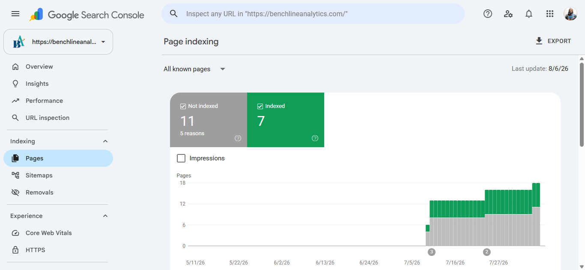

# GSC SEO Monitoring

**Google Search Console | Technical SEO | Case Study**

A real Google Search Console indexing audit for benchlineanalytics.com. Rather than treat "not indexed" as a single problem, every excluded URL was individually classified by its actual cause, separating correct WordPress behavior from genuine indexing gaps -- then only the real gaps got fixed.

---

# Project Overview

"5 indexed, 8 not indexed" tells you nothing on its own. This case study shows the actual diagnostic process: pulling every excluded URL from Search Console, checking each one's specific exclusion reason, and sorting them into three buckets -- expected/correct (robots.txt blocks, redirects, deprioritized thin content), genuinely broken (dead links), and genuinely missed (real pages Google never crawled). Only the last two categories needed action.

---

# What's Inside

1️⃣ **Sitemap verification:** Confirmed the live sitemap (`page-sitemap.xml`, 8 pages) was already submitted and successfully read, closing out a stale assumption that a different sitemap file still needed submitting.

2️⃣ **Full exclusion classification:** Every one of the 8 non-indexed URLs checked individually in GSC and sorted by real cause: robots.txt blocks, benign redirects, deprioritized thin content, dead links, and genuinely never-crawled pages.

3️⃣ **Priority crawl requests:** Used the URL Inspection tool to manually request indexing for the 3 real product pages Google had discovered via the sitemap but never actually crawled. All 3 confirmed "Indexing requested."

4️⃣ **Dead link cleanup:** Traced 2 real 404s back to footer navigation links pointing at removed pages; removed the dead links and replaced them with a real, live page.

---

# Key Metrics

| Category | Count | Action Taken |
|---|---|---|
| Indexed | 5 | None needed |
| Blocked by robots.txt (expected) | -- | None needed |
| Benign redirect | 1 | None needed |
| Deprioritized thin content (expected) | 1 | None needed |
| **Never crawled (real gap)** | **3** | **Priority crawl requested** |
| **Dead links (real gap)** | **2** | **Removed, replaced with live page** |

---

# Weekly Tracking

Ongoing snapshots captured weekly, separate from the audit case study above. Shows real ups and downs over time, not just the fixed-point before/after.

**Goal, tied to the FreelanceFlow relaunch:** 0 real 404s and 90%+ pages indexed by Pre-Launch (currently 2 real 404s, 52% indexed). See `FreelanceFlow-App/docs/metrics-goals.md` for the full framework.

| Date | Indexed | Not Indexed | Total Clicks (3mo) | Impressions (3mo) | Avg. Position | Screenshots |
|---|---|---|---|---|---|---|
| 2026-08-10 | 7 | 11 | 2 | 86 | 17.2 | [Overview](screenshots/gsc-overview-2026-08-10.png) · [Performance](screenshots/gsc-performance-2026-08-10.png) · [Indexing](screenshots/gsc-indexing-2026-08-10.png) |
| 2026-08-24 | 12 | 11 | 4 (Overview widget, ~6-week window) / 141 impr. (Site Kit 28-day widget) | -- | Not captured this pull (Performance page itself wasn't screenshotted) | Indexed count up 7->12, real improvement. Not-indexed breakdown pulled for the first time: 2 real 404s, 4 pages with redirect, 1 noindex, 1 robots-blocked, 2 "discovered, not yet indexed," 1 "crawled, not indexed" -- the 2 404s are the only clear action item, rest are mostly intentional/expected for a small site. Click/impression figures come from two different widgets with different date windows this pull (flagged, not reconciled) -- next pull should screenshot the Performance page directly for a clean apples-to-apples number. | [Overview](screenshots/gsc-overview-2026-08-24.png) · [Indexing](screenshots/gsc-indexing-2026-08-24.png) |

---

# Tools Used

- Google Search Console (URL Inspection, Coverage report, Sitemaps)
- Yoast SEO (sitemap generation)
- WordPress (footer navigation)

---

# Author

**Sawandi Kirby**

Data Analytics & Business Intelligence
Benchline Analytics - Data intelligence for organizations that mean business.

- GitHub: https://github.com/visualkirby
- LinkedIn: https://linkedin.com/in/sawandi-kirby
- Kaggle: https://kaggle.com/sawandikirby
